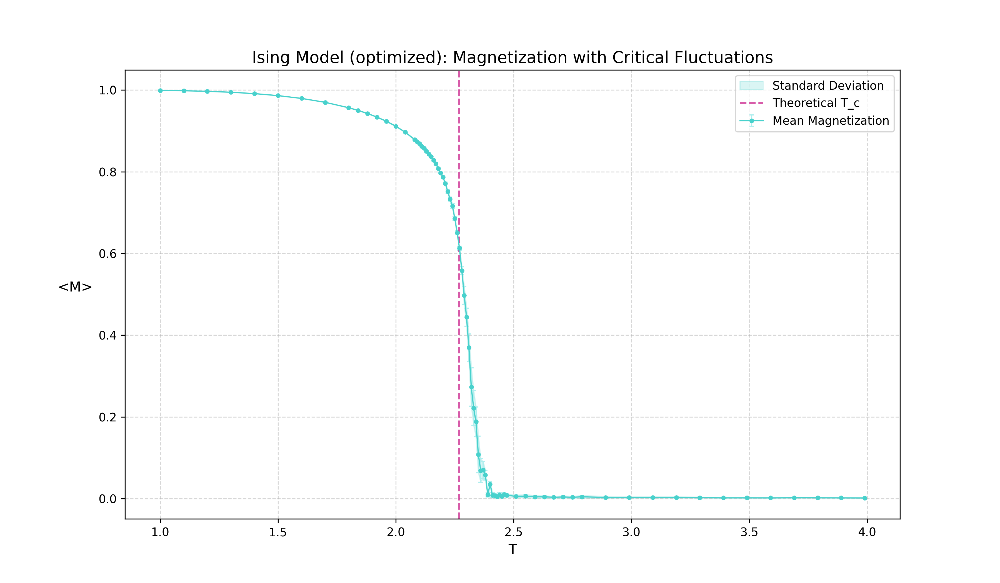

# 2D Ising Model Simulation

A high-performance Rust implementation of the 2D Ising model using the Metropolis-Hastings algorithm. This project demonstrates various optimization techniques for computational physics simulations.

## Table of Contents
- [Overview](#overview)
- [Key Features](#key-features)
- [Optimizations](#optimizations)
- [Results](#results)
- [Installation & Usage](#installation--usage)

## Overview

The Ising model is a mathematical model of ferromagnetism in statistical mechanics. The system consists of discrete variables called spins that can be in one of two states (+1 or -1) and are arranged in a graph, usually a lattice.

This simulation explores the phase transition between disordered and ordered states as a function of temperature.

## Key Features

- **Metropolis Algorithm**: Standard Markov Chain Monte Carlo (MCMC) method for sampling the equilibrium state.
- **Periodic Boundary Conditions**: Simulated on a toroidal topology to minimize edge effects.
- **Adaptive Temperature Stepping**: Dense sampling near the critical temperature ($T_c \approx 2.269$) to accurately capture phase transitions.
- **Statistical Analysis**: Built-in calculation of average magnetization and standard deviation.

## Optimizations

This project implements several performance-oriented optimizations:

1.  **Memory Layout**: Grid is stored in a flat 1D vector (`Vec<i8>`) in row-major order to maximize CPU cache hit rates and provide better data locality.
2.  **Bitwise Arithmetic**: Boundary conditions are handled using bit-masking (`& mask`) instead of the expensive modulo operator. This optimization requires the grid size ($N$) to be a power of two.
3.  **Metropolis Lookup Tables**: Boltzmann factors for the energy changes ($\Delta E \in \{4, 8\}$) are precomputed and stored in a lookup table, eliminating redundant calls to the `exp()` function in the simulation hot loop.
4.  **Inlining**: Critical functions like index calculation are hinted for aggressive inlining to reduce call overhead.

## Results

### Performance Benchmark
*Note: Results are representative of a 2048x2048 grid on a modern CPU.*

| Implementation | Sweeps/sec | Optimization Factor |
| :--- | :--- | :--- |
| **Classic** | ~25.4 | 1.0x |
| **Optimized** | ~142.8 | **~5.6x** |

### Magnetization vs. Temperature
The simulation clearly shows the phase transition at the critical point. Below $T_c$, the system remains ordered (high magnetization), while above $T_c$, it becomes disordered (near-zero magnetization).


*Figure 1: Magnetization vs. Temperature (Classic Implementation)*


*Figure 2: Magnetization vs. Temperature (Optimized Implementation)*

## Installation & Usage

### Prerequisites
- [Rust](https://www.rust-lang.org/tools/install) (2024 edition)
- Python (for plotting)

### Running Simulation
To run the simulation and generate CSV data:
```bash
cargo run --release
```

### Visualizing Results
To generate plots from the CSV data:
```bash
python plot_mag.py
```
